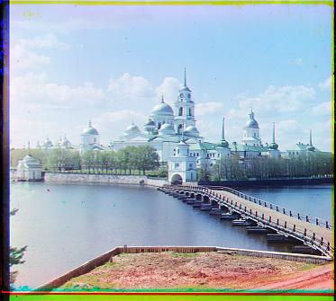

# proj1: prokudin-gorskii

## task 1: naive search
I first implemented a naive version of that will align the bgr channels by going through a set range of deltas and then finding then finding the best set of deltas amonst the channels to align with. More specifically, I would align the red and green channels with respect to blue. My initial delta range was `[-15, 15]`, and I would use two nested for loops to go through all possible ranges of `dx` and `dy`. In order to determine whether or not if a certain alignment of g/r to b was the best alignment, I initially used the `L2 norm squared` as a loss function, and the "best" metric was calculated by *minimizing* the loss. However after some testing, I found that the `L2 norm squared` was not a suitable metric. Therefore, I swtiched to using `Normalized Cross-Correlation (NCC)` as the comparison metric, which I found to be more promising. However, note that `NCC` is not a loss function but rather a scoring metric that scores the correlation between two vectors, and therefore was a *maximization* problem.

#### `NCC` implementation:
1. flatten 2d arrays to 1d arrays for faster computation
2. noramlize the flattened arrays
3. compute dot product of the arrays for metric

#### optimization
Another slight optimization I implemented was to only compute `np.roll()` on the input image with respect to `dx` in the outside for loop and then doing `np.roll()` on the resulting dx rolled image with respect to `dy`. That way there will be less computations made.

```{python}
for dx:
    #roll dx
    for dy:
        #roll dy
```

#### caveats
When I initially implemented this naive search, `cathedaral.jpg` and `tobolsk.jpg` worked fine. However, `monastery.jpg` would have a weird offset between the bgr channels, making the image look like one of those 3d image without looking at them thorugh 3d glasses. I figured that the white/black borders might have affected the NCC metric and therefore resulted in this offsetted result especially since the middle channel doesn't have a top and bottom white border like the other channels. Therefore, I tried cropping the *original* images by `2.5%` on all sides before running naive search. This worked in fixing the offsets in between bgr channels in `monastery.jpg`.

<div align="middle">
<table>
    <tr>
        <td>
            
            <p align="middle">cathedral.jpg</p>
        </td>
        <td>
            
            <p align="middle">monastery.jpg</p>
        </td>
        <td>
            
            <p align="middle">tobolsk.jpg</p>
        </td>
    </tr>
</table>
</div>

|image|red dx|red dy|green dx|green dy|runtime (seconds)|
|-|-|-|-|-|-|
|cathedral.jpg|3|-4|2|-5|0.429
|monastery.jpg|2|-9|2|-9|0.447
|tobolsk.jpg|3|-6|2|-3|0.424

## task 2: pyramid image
I recursively implemented pyramid image processing in order to efficiently process the larger .tif files. Initially I tried to recursively scale down the image by a factor of `2`, until I hit the base case, where the image width is less than `100px`. Once I hit the base case, I run the naive image `NCC` algorithm on it. Afterwards, I would scale the deltas derived form the base case by `2` at each recursive layer since the image was initially scaled by a factor of `2` at each layer.

### optimizations
In order to optimize the image, I ran the naive alignment algorithm at each recursive layer in order to fine tune results returned from the lower recursive layers. However, the delta range searched at each layer increases by `2px` as the recursion proceeds. For example, I would initially use a delta range of `[-2, 2]` and by the base case the delta range would be `[-20, 20]` if the pyramid image function recursively ran `9` times.

### caveats
The images are all scanned differently, and therefore all have different white/black borders sizes. Hence applying a generalized crop percentage for all images doesn't really work.

Initially, I tried using a white mask and diff the white mask with the image in order to eliminate the borders. It was pretty impressive and did get rid of the borders. However, a problem arose where the cropped images of the bgr channels were all in different dimensions and was hard to manipulate afterwards to the mismatch in dimensions.

Therefore, I ended up switching to using generalized percentage cropping. I cropped the *initial* image (when it still contains 3 images) by `2%` of its height and `5%` of its width on each side. This is due to the borders only being from the initial image. If I cropped each individual image after dividing the initial image into 3 pieces, I would get weird crops since the middle channel image wouldn't have white/black borders on the top and bottom.

However, this set of crop dimension didn't work for `emir.tif` and `lady.tif`. After some fine tuning, I found specific crop percentages for each image. For `emir.tif`, the crop dimensions were `1.5%` of the height on both sides, `4%` of the left side and `2%` on the right side. And for `lady.tif`, the crop dimensions were `3%` of the height and `5%` of the width on each side.

<div align="middle">
<table>
    <tr>
        <td>
            
            <p align="middle">cathedral.jpg</p>
        </td>
        <td>
            
            <p align="middle">church.jpg</p>
        </td>
        <td>
            
            <p align="middle">emir.jpg</p>
        </td>
        <td>
            
            <p align="middle">harvesters.jpg</p>
        </td>
    </tr>
    <tr>
        <td>
            
            <p align="middle">icon.jpg</p>
        </td>
        <td>
            
            <p align="middle">lady.jpg</p>
        </td>
        <td>
            
            <p align="middle">melons.jpg</p>
        </td>
        <td>
            
            <p align="middle">monastery.jpg</p>
        </td>
    </tr>
    <tr>
        <td>
            
            <p align="middle">onion_church.jpg</p>
        </td>
        <td>
            
            <p align="middle">sculpture.jpg</p>
        </td>
        <td>
            
            <p align="middle">self_portrait.jpg</p>
        </td>
        <td>
            
            <p align="middle">three_generations.jpg</p>
        </td>
    </tr>
    <tr>
    </tr>
    <tr>
        <td></td>
        <td>
            
            <p align="middle">tobolsk.jpg</p>
        </td>
        <td>
            
            <p align="middle">train.jpg</p>
        </td>
        <td></td>
    </tr>
</table>
</div>

|image|red dx|red dy|green dx|green dy|runtime (seconds)|
|-|-|-|-|-|-|
|cathedral.jpg|3|-14|2|-8|0.044
|church.jpg|-4|-197|0|-104|4.722
|emir.jpg|41|-89|23|-47|5.253
|harvesters.jpg|13|-131|16|-68|5.085
|icon.jpg|23|-170|17|-89|5.555
|lady.jpg|10|-265|8|-135|5.005
|melons.jpg|12|-78|8|-47|5.115
|monastery.jpg|2|-23|2|-16|0.039
|onion_church.jpg|36|-148|26|-76|5.026
|sculpture.jpg|-26|-121|-11|-97|5.414
|self_potrait.jpg|35|-85|26|-54|5.309
|three_generations.jpg|9|-143|11|-74|5.322
|tobolsk.jpg|3|-20|3|-10|0.040
|train.jpg|32|-169|5|-86|4.905

## bonus: auto contrast
I tried restoring some of the contrast of the images by equalizing the normalized distribution of the pixel values of each channel. I attempted to manually implement ["Contrast Limited AHE" (CLAHE)](https://en.wikipedia.org/wiki/Adaptive_histogram_equalization). Shadows and some colors became more apparent after the contrast adjustment.

<div align="middle">
<table>
    <tr>
        <td>
            
            <p align="middle">cathedral.jpg</p>
        </td>
        <td>
            
            <p align="middle">church.jpg</p>
        </td>
        <td>
            
            <p align="middle">emir.jpg</p>
        </td>
        <td>
            
            <p align="middle">harvesters.jpg</p>
        </td>
    </tr>
    <tr>
        <td>
            
            <p align="middle">icon.jpg</p>
        </td>
        <td>
            
            <p align="middle">lady.jpg</p>
        </td>
        <td>
            
            <p align="middle">melons.jpg</p>
        </td>
        <td>
            
            <p align="middle">monastery.jpg</p>
        </td>
    </tr>
    <tr>
        <td>
            
            <p align="middle">onion_church.jpg</p>
        </td>
        <td>
            
            <p align="middle">sculpture.jpg</p>
        </td>
        <td>
            
            <p align="middle">self_portrait.jpg</p>
        </td>
        <td>
            
            <p align="middle">three_generations.jpg</p>
        </td>
    </tr>
    <tr>
    </tr>
    <tr>
        <td></td>
        <td>
            
            <p align="middle">tobolsk.jpg</p>
        </td>
        <td>
            
            <p align="middle">train.jpg</p>
        </td>
        <td></td>
    </tr>
</table>
</div>

[back to project list](../index.md)
