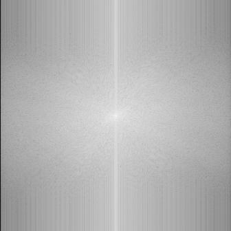
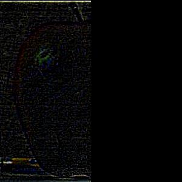

# proj2: filters and frequencies

## task 1: fun with filters

### 1.1: finite difference operator

I first found partial derivative matrices by convolving `Dx = np.array([[1, -1]])` and `Dy = np.array([[1], [-1]]` with `cameraman.png` as a gray scale image matrix. I used `scipy.signal.convolve2d` with `mode="same` to keep the dimensionality of the matrix after convolutions. Afterwards, I created a gradient magnitude matrix by using the two partial derivative matrices derived earlier. `g_m = np.sqrt(dx ** 2 + dy ** 2)`.

<table>
    <tr>
        <td>
            
            
dx

        </td>
        <td>
            
            
dy

        </td>
        <td>
            
            
gradient magnitude

        </td>
        <td>
            
            
binarized, thresh=0.25

        </td>
    </tr>
</table>

### 1.2: derivative of gaussian filter (DoG)

I applied a gaussian blur first and then found the partial derivative matrices of the blurred image to see if it helps with edge detection. The gaussian kernel was created using `cv2.getGaussianKernel`, and the 2d gaussian filter was creating doing the outer product of the gaussian kernel on itself. The kernel size `k` was `10 x 10` and the sigma was `(k-1) / 6` since ["the length of for the 99th percentile of gaussian pdf is `6 * sigma`"](https://stackoverflow.com/a/62002971).

    
    
gaussian blurred cameraman.png

<table>
    <tr>
        <td>
            
            
dx of blurred image

        </td>
        <td>
            
            
dy of blurred image

        </td>
        <td>
            
            
gradient magnitude

        </td>
        <td>
            
            
binarized, thresh=0.05

        </td>
    </tr>
</table>

Second method I tried was to first blur the derivative matrices by convolving the gaussing filter with the finite difference matrices. Afterwards, I convolved the newly transformed gaussian filters with the original image to find the gradient magnitude.

    <table>
        <tr>
            <td>
                
                
dx of gaussian

            </td>
            <td>
                
                
dy of gaussian

            </td>
        </tr>
    </table>

<table>
    <tr>
        <td>
            
            
dx of blurred image

        </td>
        <td>
            
            
dy of blurred image

        </td>
        <td>
            
            
gradient magnitude

        </td>
        <td>
            
            
binarized, thresh=0.05

        </td>
    </tr>
</table>

Both methods work well and the output resutls look basically the same. There might be slightly some more noise in the first one compared to the second one, but it is only noticable when gone a thorough examination of both images.

## task 2: fun with frequencies

### 2.1:  sharpening
Steps to sharpening an image:
1. Extract low frequencies of image via low pass filter. I used gaussian blur.
2. Extract high frequenceis of image via `image - low`.
3. Add high frequencies multipled by alpha back to image via `image + alpha * high`.

#### taj.jpg with alpha=1

<table>
    <tr>
        <td>
            
            
taj.jpg

        </td>
        <td>
            
            
low taj.jpg

        </td>
        <td>
            
            
high taj.jpg

        </td>
        <td>
            
            
sharpened taj.jpg, alpha=1

        </td>
    </tr>
</table>

#### side note
> I used `cv2` operations since they automatically deal with out of range values. I tried using `np.clip` after doing np matrix operations before but `cv2` operations do a much better job.

#### taj.jpg

<table>
    <tr>
        <td>
            
            
alpha=0

        </td>
        <td>
            
            
alpha=1

        </td>
        <td>
            
            
alpha=2

        </td>
        <td>
            
            
alpha=5

        </td>
        <td>
            
            
alpha=20

        </td>
    </tr>
</table>

#### mlord.png

<table>
    <tr>
        <td>
            
            
alpha=0

        </td>
        <td>
            
            
alpha=1

        </td>
        <td>
            
            
alpha=2

        </td>
        <td>
            
            
alpha=5

        </td>
        <td>
            
            
alpha=20

        </td>
    </tr>
</table>

#### nostudy.png

<table>
    <tr>
        <td>
            
            
alpha=0

        </td>
        <td>
            
            
alpha=1

        </td>
        <td>
            
            
alpha=2

        </td>
        <td>
            
            
alpha=5

        </td>
        <td>
            
            
alpha=20

        </td>
    </tr>
</table>

I also tried "resharpening" an image by blurring an already sharp image and then sharpening it again.

#### nosleep.jpg

<table>
    <tr>
        <td>
            
            
initial sharpened image, alpha=2

        </td>
        <td>
            
            
blur of initial image

        </td>
        <td>
            
            
sharpen, alpha=2

        </td>
    </tr>
</table>

>The resharpened image has more clear edges but has weird artifacts, presumably from creating previously nonexistant edges into edges. e.g. the face shading now has a bunch of weird cracks now.

### 2.2: hybrid images
To make make some hybrid images, align an the two images and then sum up one image's low frequencies and the other's high frequencies.

#### derek and nutmeg

<table>
    <tr>
        <td>
            
            
derek

        </td>
        <td>
            
            
nutmeg

        </td>
        <td>
            
            
a furry

        </td>
    </tr>
</table>

#### chimera

<table>
    <tr>
        <td>
            
            
nina from full metal alchemist

        </td>
        <td>
            
            
nina's dog

        </td>
        <td>
            
            
...

        </td>
    </tr>
</table>

#### gogeta

<table>
    <tr>
        <td>
            
            
goku

        </td>
        <td>
            
            
vegeta

        </td>
        <td>
            
            
fusion!

        </td>
    </tr>
</table>

### frequency analysis

<table>
    <tr>
        <td>
            
            
goku fft

        </td>
       <td>
            
            
goku high freq fft

        </td>
    </tr>
        <tr>
        <td>
            
            
vegeta fft

        </td>
        <td>
            
            
vegeta low freq fft

        </td>
    </tr>
    <tr>
        <td>
            
            
gogeta fft

        </td>
    </tr>
</table>

The fft shows how the images align their frequencies an create the hybrid image of gogeta. You can tell via the white lines of frequencies from both images.

### 2.3: gaussian and laplacian stack

I did each stack to 10 layers.

#### gaussian stack of apple

<table>
    <tr>
        <td>
            
            
layer 0

        </td>
        <td>
            
            
layer 3

        </td>
         <td>
            
            
layer 6

        </td>
        <td>
            
            
layer 10

        </td>
    </tr>
</table>

#### gaussian stack of orange

<table>
    <tr>
        <td>
            
            
layer 0

        </td>
        <td>
            
            
layer 3

        </td>
         <td>
            
            
layer 6

        </td>
        <td>
            
            
layer 10

        </td>
    </tr>
</table>

#### laplacian stack of apple

<table>
    <tr>
        <td>
            
            
layer 0

        </td>
        <td>
            
            
layer 3

        </td>
         <td>
            
            
layer 6

        </td>
        <td>
            
            
layer 10

        </td>
    </tr>
</table>

#### laplacian stack of orange

<table>
    <tr>
        <td>
            
            
layer 0

        </td>
        <td>
            
            
layer 3

        </td>
         <td>
            
            
layer 6

        </td>
        <td>
            
            
layer 10

        </td>
    </tr>
</table>

### 2.4: multiresolution blending

#### oraple
please forigve me as i accidentally did 1 more layer than the paper itself.

<table>
    <tr>
        <td>
            
layer 0

        </td>
        <td>
            
            
apple

        </td>
        <td>
            
            
orange

        </td>
         <td>
            
            
combined

        </td>
    </tr>
    <tr>
        <td>
            
layer 2

        </td>
        <td>
            
            
apple

        </td>
        <td>
            
            
orange

        </td>
         <td>
            
            
combined

        </td>
    </tr>
    <tr>
        <td>
            
layer 4

        </td>
        <td>
            
            
apple

        </td>
        <td>
            
            
orange

        </td>
         <td>
            
            
combined

        </td>
    </tr>
    <tr>
        <td>
            
layer 7

        </td>
        <td>
            
            
apple

        </td>
        <td>
            
            
orange

        </td>
         <td>
            
            
combined

        </td>
    </tr>
</table>

<table>
    <tr>
        <td>
            
            
apple

        </td>
        <td>
            
            
orange

        </td>
        <td>
            
            
mask

        </td>
         <td>
            
            
combined

        </td>
    </tr>
</table>

#### oraple horizontal
<table>
    <tr>
        <td>
            
            
apple

        </td>
        <td>
            
            
orange

        </td>
        <td>
            
            
mask

        </td>
         <td>
            
            
combined

        </td>
    </tr>
</table>

#### kirby
<table>
    <tr>
        <td>
            
            
kirby

        </td>
        <td>
            
            
kirby blue

        </td>
        <td>
            
            
mask

        </td>
         <td>
            
            
combined

        </td>
    </tr>
</table>

#### gudetama breakfast (fail)
<table>
    <tr>
        <td>
            
            
gudetama

        </td>
        <td>
            
            
breakfast

        </td>
        <td>
            
            
mask

        </td>
         <td>
            
            
combined

        </td>
    </tr>
</table>

#### here's a cursed egg instead
<table>
    <tr>
        <td>
            
            
gudetama

        </td>
        <td>
            
            
breakfast

        </td>
        <td>
            
            
mask

        </td>
         <td>
            
            
combined

        </td>
    </tr>
</table>

### reflection
pretty fun project overall. learned how frequencies worked and basically how photoshop works with masking. made some fun references to some of my favorite animes :).

[back to project list](../index.md)
