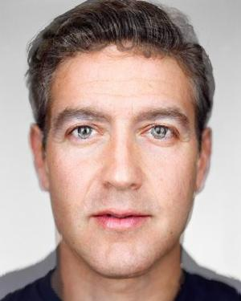

# proj3: it's morphin' time (face morphing)

In this project, I will be morphing one face to another and also do some experimentation with population mean faces.

## task 1: defining correspondences
For the first morph, I decided to morph George Clooney's face to Mark Zuckerberg's face and vice versa. Photos are from [Martin Schoeller's portfolio](https://martinschoeller.com).

I created a triangular mask for each photo using [Delaunay triangulation](https://en.wikipedia.org/wiki/Delaunay_triangulation). Both photos contain the same triangular structure as each other, so translating corresponding keypoints and triangluar regions is easier.

<table>
    <tr>
        <td>
            
            
george clooney

        </td>
        <td>
            
            
george clooney with keypoints mask

        </td>
    </tr>
</table>

<table>
    <tr>
        <td>
            
            
mark zuckerberg

        </td>
        <td>
            
            
mark zuckerberg with keypoints mask

        </td>
    </tr>
</table>

## task 2: computing "midway face"
To compute the "midway face":
1. Find the average triangulation and keypoints between the two triangular mask.
> Although the relative structure of the triangular masks are the same, the coordinates are not exactly the same and therefore we need a triangular mask that is the composed of the average of the keypoints and their respective positions.
2. Warp the images to the average triangular mask, I used inverse warping
> For each triangle in the triangular mask:
>
> 1. Find the affine transformation matrix from avg keypoints to img keypoints. This can be done by using `np.linalg.solve`, where `a` is the avg keypoints matrix and `b` is the img keypoints matrix. Make sure that each keypoint is in this format: `[x, y, 1]`, since `np.linalg.solve` solves `ax = b` for `x`. The resulting affine transformation matrix will be `A = x.T`.
> 2. Use the affine matrix to find the points that correspond to the region in the avg triangle in the img triangle by doing `A @ avg_points_matrix`.
> 3. Use nearest neighbor interpolation to find the resulting img coordinates for transformed coordinates that are in between coordinates (aka are floats and not integers)
> 4. Place the image values that are located at the img coordinates derived from `3.` into the warped image array.

3. Cross-disolve the two warped images by taking the average of the RGB values of the warped images

<table>
    <tr>
        <td>
            
            
clooney

        </td>
         <td>
            
            
clooney and mark avg keypoints

        </td>
        <td>
            
            
zuck

        </td>
    </tr>
</table>

<table>
    <tr>
        <td>
            
            
clooney warped

        </td>
        <td>
            
            
clooney and zuck mean face

        </td>
        <td>
            
            
zuck warped

        </td>
    </tr>
</table>

## task 3: morph sequence
Creating a morph sequence is similar to calculating the midway face but instead of keeping a constant warp alpha and dissolve alpha at 0.50, we do a linear interoplation of the the two constants to get a smooth transistion of morphs.

To create this linear interpolation, I just used `np.linspace` to create 45 alphas that can be in between the range of `[0, 1]`, since I want to create 45 frames of in-between morph sequences. Each frame uses the same alpha for warping and cross-dissolving, which seems to work fine. However, I think a smoother transition can be done if the warp alpha was a function of dissolve alpha for some function `f`. This probably needs a bit more testing and research before much more can be said.

## task 4: "mean face" of population
I generated a mean face using the Danes dataset of annotated faces (30 males, 7 females).

To generate the mean face:
1. Find the average triangular mask of all the faces
2. Warp each img to the average triangular mask
3. Compute the average RGB values of all the warped images

danes mean face

<table>
    <tr>
         <td>
            
            
swift warped to danes mean face

        </td>
        <td>
            
            
danes mean face warped to swift

        </td>
    </tr>
</table>

#### Examples of faces in dataset warped to danes mean face

<table>
    <tr>
        <td>
            
            
07-1m

        </td>
         <td>
            
            
12-1f

        </td>
    </tr>
    <tr>
        <td>
            
            
23-1m

        </td>
         <td>
            
            
31-1m

        </td>
    </tr>
</table>

## task 5: extrapolating from the mean (danish taylor swift)
Caricatures of a face can be derived from this formula: `caricature = alpha * (average_keypoints - original_keypoints) + original_keypoints`. Here are some with examples of Taylor Swift being more or less Danish by tuning the alpha.

<table>
    <tr>
        <td>
            
            
alpha=-0.75

        </td>
         <td>
            
            
alpha=-0.25

        </td>
        <td>
            
            
alpha=0

        </td>
       <td>
            
            
alpha=-0.25

        </td>
        <td>
            
            
alpha=0.75

        </td>
    </tr>
</table>

## bells and whistles

### reflection
pretty fun project over all and learned more the applications of affine transformations in computer vision.
[back to project list](../index.md)
