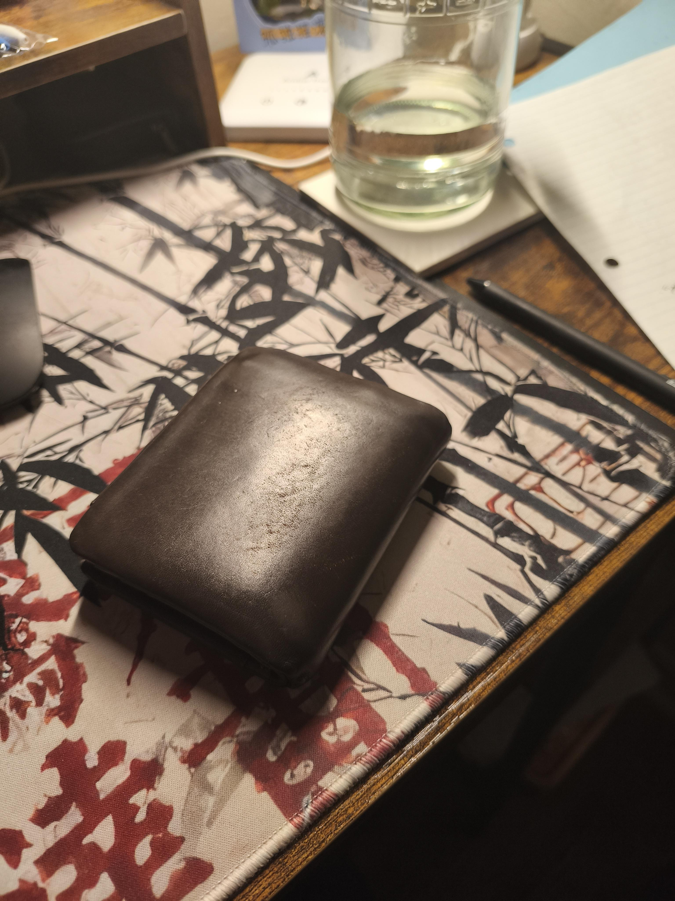
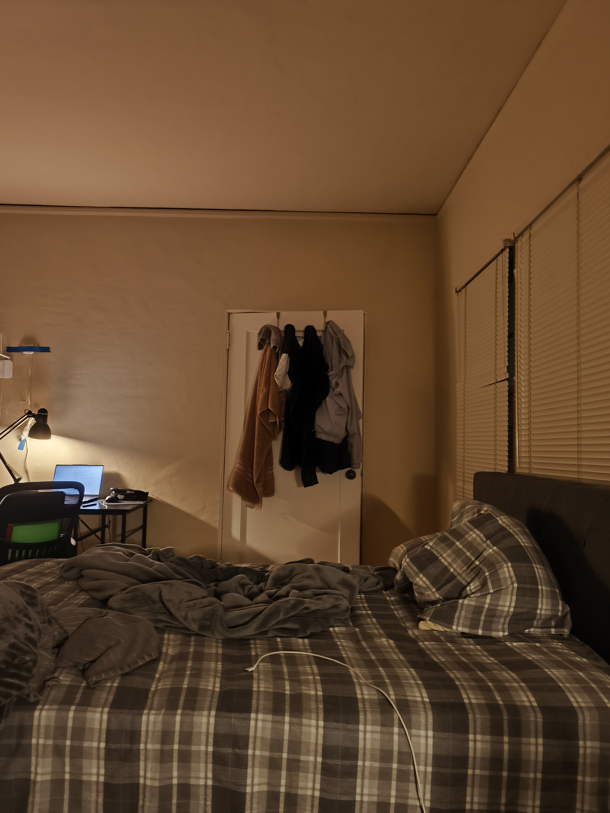

# proj4a: Image Stitching and Mosaic

In the first part of this project, I will be attempting to stich photos taken from the same focal point but at different angles by using homographies and 2-band frequency blending.

## Photos Used

#### wallet for rectification

<table>
    <tr>
        <td>
            
        </td>
    </tr>
</table>

#### laptop for rectification

<table>
    <tr>
        <td>
            
        </td>
    </tr>
</table>

#### desk for mosaic stitching

<table>
    <tr>
        <td>
            
        </td>
        <td>
            
        </td>
    </tr>
</table>

#### another messy desk for mosaic stitching

<table>
    <tr>
        <td>
            
        </td>
        <td>
            
        </td>
    </tr>
</table>

#### bed for mosaic stitching

<table>
    <tr>
        <td>
            
        </td>
        <td>
            
        </td>
        <td>
            
        </td>
    </tr>
</table>

#### safeway for mosaic stitching

<table>
    <tr>
        <td>
            
        </td>
        <td>
            
        </td>
        <td>
            
        </td>
    </tr>
</table>

## Recovering Homographies
We need to use a homography matrix in other to conduct a perspective warp (or transformation). A perspective warp utilizes eight degrees of freedom to warp one image to another.

The Homography matrix H is defined to be:

    

To find the the "weights" of the homography matrix, I used the formula described in this [paper](https://cseweb.ucsd.edu/classes/wi07/cse252a/homography_estimation/homography_estimation.pdf). To summarize, given `src_points = (x1, y1)` and `dest_points = (x2, y2)`, I create a matrix `A` such that `a_x = [-x1, -y1, -1, 0, 0, 0, x1 * x2, y1 * x2, x2]` and `a_y = [0, 0, 0, -x1, -y1, -1, x1 * y2, y1 * y2, y2]`. I then compute the SVD of matrix `A` to find `V.T`. The last column of `V.T` reshaped into a `3x3` matrix and then normalized such that the last element at index `(2, 2)` (according to 0 indexing) is `1.0` is the Homography matrix we are looking for.

> Side note: To normalize the Homography matrix with respect to the last element is just to divide each element of the column vector `V.T` by the last element of the `V.T` and then respahing `V.T` into the shape `(3, 3)`

## Rectification

To test the homography matrices, I first took some photos of rectangular objects at an angle and then warped those images to rectangles (aka rectifying them). Just to note, the `src_points` of `computeHomography` come from keypoints mapped on the angled photo while the `dest_points` of `computeHomography` is just some points that form a rectangle that is relative to the size of the image.

#### laptop.jpg

<table>
    <tr>
        <td>
            
            
laptop

        </td>
        <td>
            
            
laptop rectified

        </td>
    </tr>
</table>

#### wallet.jpg

<table>
    <tr>
        <td>
            
            
wallet

        </td>
        <td>
            
            
wallet rectified

        </td>
    </tr>
</table>

## Mosaic Stitching

I used 2-frequency blending to blend the mosaic together. This was achieved by using laplacian stacks on the images and a gaussian stack on the mask with a depth of `2`. The boundary in the mask was determined to be the middle split of region of intersections between the images.

### Caveats
Since my images were huge (around `4000 x 3000`), my gaussian kernel had to be huge for the blur between edges to be noticable. However, having a huge kernel takes a long time to compute. After some testing, a kernel with `k = 25` took around one minute to compute; a kernel with `k = 50` took around five minutes to compute; a kernel with `k = 100` took around twenty minutes to compute. I ended up going with using `k = 50` to compute my blurs since it produced a similar output as `k = 100` with a reasonable runtime.
I also wrote code to find the approximate edge between the two images. Then, I created a bounding box that contained both images and blended the bounding box to reduce runtime as blending the entire image would've taken a longer time. In retrospect, if I were to layer multiple images at once, this algorithm would run slower as I would have to find a bounding box for each edge and run the blending on each bounding box individually. In that regard, I would just run the 2-band blending on the whole image.

My phone camera seems to ***auto adjust*** the lighting after taking a photo, and I do not know how to turn off this feature. Therefore, my photos that I stitched together seems to have different lighting even though they were taken in the same setting at the same time. This caused the images look a bit funky after the stitching process. I tried my best to take photos in a setting where the auto color correction wouldn't change too much in between photos, but it is still a tiny bit noticable in some photos. Maybe I can code an auto color correction algorithm such that the images are in the relatively same lighting in the future to fix this.

### desk.jpg

<table>
    <tr>
        <td>
            
            
left

        </td>
        <td>
            
            
right

        </td>
    </tr>
</table>

final

### [failed] desk.jpg with left, right, middle

<table>
    <tr>
        <td>
            
            
left

        </td>
        <td>
            
            
middle

        </td>
        <td>
            
            
right

        </td>
    </tr>
</table>

final

> I think for this bigger mosaic I messed up the when taking the photos such that the `right` photo didn't have the same `center of projection` as the `left` and `middle` photos. Either that or I messed up the corrspondence points. I think the former is the more likely culprit.

### monitor.jpg (aka messy desk part 2)

<table>
    <tr>
        <td>
            
            
left

        </td>
        <td>
            
            
right

        </td>
    </tr>
</table>

final

### [failed] bed.jpg

<table>
    <tr>
        <td>
            
            
left

        </td>
        <td>
            
            
right

        </td>
    </tr>
</table>

final

<table>
    <tr>
        <td>
            
            
left

        </td>
        <td>
            
            
middle

        </td>
        <td>
            
            
right

        </td>
    </tr>
</table>

final

> Phone camera lighting auto adjustment issue as mentioned in caveats.

### safeway.jpg

<table>
    <tr>
        <td>
            
            
left

        </td>
        <td>
            
            
right

        </td>
    </tr>
</table>

final

<table>
    <tr>
        <td>
            
            
left

        </td>
        <td>
            
            
middle

        </td>
        <td>
            
            
right

        </td>
    </tr>
</table>

final

### 4a Reflection
I overall enjoyed taking photos and then stitching the images into mosaics. I had some trouble getting the images to have the same lighting, due to the nature of my phone camera which auto adjusts the image after it being taken. Furthermore the images taken from different angles affected how much light the camera was receiving and therefore may have affected the lighting of the photos and mad the stiching look weird and the photos with different lighting. I think I could've implemented an auto color correction or averaging algorithm between the images to solve this issue from a software standpoint, but I didn't have enough time to implement this during this project due to the heavy courseload I'm taking this semester. Maybe I will come back later, to try to implement a better stitching algorithm as well as a color correction algorithm.

# proj4b: [Auto]-Stitching and Mosaics

Time for the fun part. Also, a lot of the work here was based on this paper: [“Multi-Image Matching using Multi-Scale Oriented Patches” by Brown et al.](https://inst.eecs.berkeley.edu/~cs180/fa24/hw/proj4/Papers/MOPS.pdf).

## Harris Coner Detection
Harris corner detection takes in a grayscale image and computes the horizontal and vertical derivatives at each pixel along the image using a shifting window. If there's barely any cahnge, there's no notable edges or corners. If there's a lot of change in one direction we know there's an edge. If there's a lot of change in all directions, then we know there's a corner. To learn more, here's the [wikipedia](https://en.wikipedia.org/wiki/Harris_corner_detector) and [opencv documentation](https://docs.opencv.org/4.x/dc/d0d/tutorial_py_features_harris.html) with more detailed math and explanations.

### Caveats
The Harris corner detection algorithm is a bit brute force like and takes a long runtime with a huge image (like my phones photos are roughly 4000 x 3000). Hence, for this part of the project I will be downsampling (with anti-anlising) my images.

The Harris corner detetion detected around `18000` points in total on the ***downsampled*** image. For display purposes, I only plotted the first `5000` points.

<table>
    <tr>
        <td>
            
            
original downsampled

        </td>
        <td>
            
            
5000 points

        </td>
    </tr>
</table>

## Adaptive Non-Maximal Suppression (ANMS)

There are too many points produced by the Harris corner detection algorithm. In order to filter the points, I used the adaptive non-maximal suppression (ANMS) algorithm. The basic idea is to remove keypoints that are not the strongest in their local neighborhood. To achieve this, we need some strength metric that can be measured between two points. This strength metric (or strength funciton `f` however you want to see it) can be obtain by creating a measure of how corner-like a point is from the Harris corner detection (this metric is produced while going thorugh Harris detection). Now that the strength metric is decided, we can move on to how the suppression works. We want each point to have a radius `r` that determines how far it is from its nearest neighbor. We want to minimize this distance such that the the strength metric of the current point `f(x)` is sufficiently suppressed by a neighboring point's strength metric under a threshold contraint `threshold * f(y)`. In order to find the best points, we want to find points with the largest `r`. For my specific use case, I just took the the top 500 points and set the `threshold = 0.9`.

> Here's the minimization problem.

<table>
    <tr>
        <td>
            
            
original downsampled

        </td>
        <td>
            
            
500 points

        </td>
    </tr>
</table>

## Feature Descriptor Extraction
Although we found a bunch of points, we can find points on two images, but still don't know which point corresponds to what point. In order to pinpoint correspondence, we will see if features match up. First, we gotta extract the feature at each point.

To generate features at a particular point:
1. Convert image to grayscale
2. Create a `(40, 40)` window at the point
3. Downsize the descriptor window to `(8, 8)`
4. Bias-Gain normalize the downsized descriptor (`D' = (D - mu) / sigma`)

> These feature descriptors are called "Multi-Scale Oriented Patches" (MOPS) as mentioned in the paper.

## Feature Matching
In order to feature match, we need some kind of metric to determine how features match. To do this, I used `sum squared error` to determine the difference between one feature and another. The less error, the more similar the features are.

However, features can match but not be at the same point. In order to differentiate features, we can use Lowe's approach. Lowe suggested that one can determine if a feature corresponds to another specific similar feature if it is very unsimilar to the next closest similar image. To determine this we can use the ratio of errors between the most similar feature and the next most similar feature dentoed by `e_1 / e_2`. If the error ratio is below some certain `lowe_threshold`, then we can say that the features aren't that similar and hence state that the most similar feature is the corresponding feature we are looking for. After some emprical testing, the paper concluded that `lowe_threshold = 0.2` is pretty good in getting correct matches, which is what I used.

In this case we can say that "most similar" can be anagolous to "nearest neigbor" and that we can use a nearest neighbor algorithm to determine the most similar features corresponding to a particular feature. In this case, we can use `kd-trees`. I didn't implement it, but I think I can do so in the future when I'm a bit less busy :(. Instead of using `kd-trees`, I just brute-forced 500 pairwise `ssd errors` using some nice np matrix and vector techniques, which runtime wise was not bad.

#### Some desk-0.jpg and desk-1.jpg feature matches

<table>
    <tr>
        <td>
            
        </td>
        <td>
            
        </td>
    </tr>
     <tr>
        <td>
            
        </td>
        <td>
            
        </td>
    </tr>
     <tr>
        <td>
            
        </td>
        <td>
            
        </td>
    </tr>
     <tr>
        <td>
            
        </td>
        <td>
            
        </td>
    </tr>
     <tr>
        <td>
            
        </td>
        <td>
            
        </td>
    </tr>
</table>

## Random Sample Consensus (RANSAC)

## Homography Estimation + Stitching
I used the same stitching method as I did from Part A of this project. The only difference is that we're now using the homography matrix estimated from RANSAC and feature matching. I think the estimation did a pretty good job, but it seems to be slightly lacking compared to manually matching correspondence. But what can you expect, I think it did amazingly well for automatic homography estiamtion.

### desk.jpg

<table>
    <tr>
        <td>
            
            
manual

        </td>
        <td>
            
            
auto

        </td>
    </tr>
</table>

### monitor.jpg (aka messy desk part 2)

<table>
    <tr>
        <td>
            
            
manual

        </td>
        <td>
            
            
auto

        </td>
    </tr>
</table>

### safeway.jpg

<table>
    <tr>
        <td>
            
            
manual

        </td>
        <td>
            
            
auto

        </td>
    </tr>
</table>

### [for fun] bed.jpg

<table>
    <tr>
        <td>
            
            
manual

        </td>
        <td>
            
            
auto

        </td>
    </tr>
    <tr>
        <td>
            
            
manual

        </td>
        <td>
            
            
auto

        </td>
    </tr>
</table>

### 4b Reflection
I learned a lot about various techniques on auto feature detection and using derivatives/moments to capture feature textures. I've also noticed that feature detection isn't just based on one single algorithm but rather multiple algorithms that detect multiple things that compose of the feature. Additionally, one can first get a lot of data and then pinpoint the good data/filter out the useless data to capture the features we want. Overall pretty fun project and I can't wait to see how neural networks come into play in the next project (maybe?).

[back to project list](../index.md)
