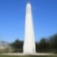



# Proj5a: Power of Diffusion Models

Diffusion model shenanigans. Using [DeepFloyd IF](https://huggingface.co/docs/diffusers/api/pipelines/deepfloyd_if) diffusion model trained by Stablility AI. This model takes in `64x64` images and produces `64x64` images from its first stage. I did not upsample the images into `256x256` images using the second stage of the model due to lack of google colab credits :(. The first part will be going through the implementation of a diffusion model and its steps while the second part will be implementing some cool results from some fairly recent papers.

## 0.1 Seed + Setup
I used `SEED=501`.

Here some of the ouput images after passing it through stage 1 and 2 UNets of the model. It appears that the number of iterative steps the model takes affects the output image pretty drastically even though the same word embedding was used.

10 steps

20 steps

40 steps

## 1.1 Forward Function
We need to implement a function that adds noise to an image. This is achieved with this formula:

$$
x_t = \sqrt{\bar{\alpha}_t}x_0 + \sqrt{1 - \bar\alpha_t}\epsilon, \space where \space \epsilon \sim N(0, 1)
$$

We are using a noise generator (or estimation) using a standard normal distirbution $\epsilon$, which can be calculated via `torch.randn_like`, and an `alpha_cumprod` $\bar\alpha_t$ of $t$ step. As $t$ increases, so does the amount of noise added to the image increase.

    <table>
        <tbody align=center>
            <tr>
                <td>
                    
                    
campanile.jpg

                </td>
                <td>
                    
                    
t=250

                </td>
                <td>
                    
                    
t=500

                </td>
                <td>
                    
                    
t=750

                </td>
            </tr>
        </tbody>
    </table>

## 1.2 Classical Denoising
After noise-ifying images, we can train a diffusion model to estimate denosising processes of these noisified image. That way the diffusion model can later "generate" images by converting random noisy images not on the real image manifold into images related to the input fed into the model.

We will first try to implement a classical denoising method via Gaussian Blur Filtering. In particular, I used `torchvision.trnasforms.functional.gaussian_blur` with a kernel size of `(7, 7)` to implement the blurs on the noisy images. This will pass the noisy image through a low pass filter and therefore get rid of some of the low frequency noise. However, as seen by the results, the Gaussian Blur Filter doesn't get rid of all the noise and it also blurs the original image.

    <table>
        <tr>
            <td>
                
                
t=250

            </td>
            <td>
                
                
t=500

            </td>
            <td>
                
                
t=750

            </td>
        </tr>
    </table>

<table>
    <tr>
        <td>
            
            
blur t=250

        </td>
        <td>
            
            
blur t=500

        </td>
        <td>
            
            
blur t=750

        </td>
    </tr>
</table>

## 1.3 One Step Denoising
We can further improve the denoising by using a pretrained diffusion model to estimate the noise in the new noisy image and then remove that estiamted noise from that same noisy image to get closer towards the original image. Since DeepFloyd was trained on text conditioning, we use the first stage UNet on the condition of `"a high quality photo"`.

In comparison to the Gaussian Blur Filter, this method of denoising gets rid of all the noise. However, the predicted image still tends to be blurred and loeses some of the structure and detailes that were in the original image.

<table>
    <tr>
        <td>
            
            
t=250

        </td>
        <td>
            
            
t=500

        </td>
        <td>
            
            
t=750

        </td>
    </tr>
</table>

<table>
    <tr>
        <td>
            
            
one-step t=250

        </td>
        <td>
            
            
one-step t=500

        </td>
        <td>
            
            
one-step t=750

        </td>
    </tr>
</table>

## 1.4 Iterative Denoising

Another method of denoising we can use is iterative denoising, the default denoising method used by diffusion models. It would be tedious and expensive to go through each step, espcially if $T$ is very large. Therefore, we iterate through some `strided_timesteps` with `strides=30`. The formula is given below with $t$ being the current timestep and $t'$ being an earlier timestep such that $t' < t$.

$$
x_{t'} = \frac{\sqrt{\bar\alpha_{t'}}\beta_t}{1 - \bar\alpha_t} x_0 +
        \frac{\sqrt{\alpha_t}(1 - \bar\alpha_{t'})}{1 - \bar\alpha_t} x_t +
        v_\sigma
$$

$$
\alpha_t = \frac{\bar\alpha_t}{\bar\alpha_{t'}}
$$

$$
\beta_t = 1 - \alpha_t
$$

$x_0$ is the estimated clean image at each iterative step using the formula used in the forward process with noise $\epsilon$ being the estimated noise from UNet output.

<table>
    <tr>
        <td>
            
            
t=90

        </td>
        <td>
            
            
t=240

        </td>
        <td>
            
            
t=390

        </td>
        <td>
            
            
t=540

        </td>
        <td>
            
            
t=690

        </td>
    </tr>
</table>

<table>
    <tr>
        <td>
            
            
campanile.jpg

        </td>
        <td>
            
            
iterative

        </td>
        <td>
            
            
one-step

        </td>
        <td>
            
            
gaussian blur

        </td>
    </tr>
</table>

## 1.5 Diffusion Model Sampling
We are going to generate images from scratch by starting the iterative denoising at $T$ timestep (the max timestep) and feeding the model a random noisy image generated via `torch.rand_like` and with the word embedding `"a high quailty photo"`. Here are some samples I genereated using iterative denoising.

<table>
    <tr>
        <td>
            
        </td>
        <td>
            
        </td>
        <td>
            
        </td>
        <td>
            
        </td>
        <td>
            
        </td>
    </tr>
</table>

## 1.6 Classifier Free Guidance (CFG)
Some of the images generated by iterative denoising seem really random or confusing. To fix this, we will use [Classifier Free Guidance](https://arxiv.org/abs/2207.12598), which uses an conditional and unconditional noise estimate the new noise.

$$\epsilon = \epsilon_u + \gamma(\epsilon_c - \epsilon_u)$$

For these images, I used `"a high quality photo"` for the UNet embedding that would estimate conditional noise and a null prompt of `""` as the unconditional noise. Furthermore, I used $\gamma=7$ when calculating the overall noise estimate.

<table>
    <tr>
        <td>
            
        </td>
        <td>
            
        </td>
        <td>
            
        </td>
        <td>
            
        </td>
        <td>
            
        </td>
    </tr>
</table>

## 1.7 Image to Image Translation
Instead of passing in a randomly generated image, we will pass in a noise-ified image (using `forward(img, t)`) of the original image at different timesteps in order to get the diffusion model to output something similar to the original image we noise-ified.

> **Side Note:** I used a `strided_timesteps` array that ranged from `[990, 0]` with a `stride=30`. When `i_start=0`, `t=990`, which the timestep at which `forward(img, t)` would return the noisiest version of the original image.

### campanile.jpg

<table>
    <tr>
        <td>
            
            
i_start=0

        </td>
        <td>
            
            
i_start=3

        </td>
        <td>
            
            
i_start=5

        </td>
        <td>
            
            
i_start=7

        </td>
        <td>
            
            
i_start=10

        </td>
        <td>
            
            
i_start=20

        </td>
    </tr>
</table>

### nyc.jpg

<table>
    <tr>
        <td>
            
            
i_start=0

        </td>
        <td>
            
            
i_start=3

        </td>
        <td>
            
            
i_start=5

        </td>
        <td>
            
            
i_start=7

        </td>
        <td>
            
            
i_start=10

        </td>
        <td>
            
            
i_start=20

        </td>
    </tr>
</table>

### sf.jpg

<table>
    <tr>
        <td>
            
            
i_start=0

        </td>
        <td>
            
            
i_start=3

        </td>
        <td>
            
            
i_start=5

        </td>
        <td>
            
            
i_start=7

        </td>
        <td>
            
            
i_start=10

        </td>
        <td>
            
            
i_start=20

        </td>
    </tr>
</table>

## 1.7.1 Hand Drawn and Web Images
Let's see if CFG with DeepFloyd runs well on hand drawn images and images taken from the web!

### web: jinx.jpg

<table>
    <tr>
        <td>
            
            
i_start=0

        </td>
        <td>
            
            
i_start=3

        </td>
        <td>
            
            
i_start=5

        </td>
        <td>
            
            
i_start=7

        </td>
        <td>
            
            
i_start=10

        </td>
        <td>
            
            
i_start=20

        </td>
        <td>
            
            
jinx.jpg

        </td>
    </tr>
</table>

### hand drawn: pikachu?

<table>
    <tr>
        <td>
            
            
i_start=0

        </td>
        <td>
            
            
i_start=3

        </td>
        <td>
            
            
i_start=5

        </td>
        <td>
            
            
i_start=7

        </td>
        <td>
            
            
i_start=10

        </td>
        <td>
            
            
i_start=20

        </td>
                <td>
            
            
pikachu.jpg

        </td>
    </tr>
</table>

### hand drawn: ditto?

<table>
    <tr>
        <td>
            
            
i_start=0

        </td>
        <td>
            
            
i_start=3

        </td>
        <td>
            
            
i_start=5

        </td>
        <td>
            
            
i_start=7

        </td>
        <td>
            
            
i_start=10

        </td>
        <td>
            
            
i_start=20

        </td>
        <td>
            
            
ditto.jpg

        </td>
    </tr>
</table>

## 1.7.2 Inpainting
We can use a mask and only pass in the mask portion through the forwarding process such that the diffusion model will only generate within the masked area.

$$
x_t = \textbf{m} x_t + (1 - \textbf{m})\text{forward}(x_{orig}, t)
$$

### campanile.jpg

<table>
    <tr>
        <td>
            
            
campanile.jpg

        </td>
        <td>
            
            
mask

        </td>
                <td>
            
            
to replace

        </td>
        <td>
            
            
inpainted

        </td>
    </tr>
</table>

### nyc

<table>
    <tr>
        <td>
            
            
nyc.jpg

        </td>
        <td>
            
            
mask

        </td>
                <td>
            
            
to replace

        </td>
        <td>
            
            
inpainted

        </td>
    </tr>
</table>

### sh

<table>
    <tr>
        <td>
            
            
sh.jpg

        </td>
        <td>
            
            
mask

        </td>
                <td>
            
            
to replace

        </td>
        <td>
            
            
inpainted

        </td>
    </tr>
</table>

## 1.7.3 Text Conditional Image to Image Translation
We are going to run the image translation again, but we'll replace the generic embedding `"a high quality photo"` into a specific prompt. The generated models will look more like either the prompt or the original image passed into the model depending on how noisy the initial forwarding process is.

### `"a rocket ship"` $\longrightarrow$ campanile.jpg

<table>
    <tr>
        <td>
            
            
i_start=0

        </td>
        <td>
            
            
i_start=3

        </td>
        <td>
            
            
i_start=5

        </td>
        <td>
            
            
i_start=7

        </td>
        <td>
            
            
i_start=10

        </td>
        <td>
            
            
i_start=20

        </td>
        <td>
            
            
campanile.jpg

        </td>
    </tr>
</table>

### `"a lithograph of waterfalls"` $\longrightarrow$ nyc.jpg

<table>
    <tr>
        <td>
            
            
i_start=0

        </td>
        <td>
            
            
i_start=3

        </td>
        <td>
            
            
i_start=5

        </td>
        <td>
            
            
i_start=7

        </td>
        <td>
            
            
i_start=10

        </td>
        <td>
            
            
i_start=20

        </td>
        <td>
            
            
nyc.jpg

        </td>
    </tr>
</table>

### `"an oil painting of a snowy mountain village"` $\longrightarrow$ sf.jpg

<table>
    <tr>
        <td>
            
            
i_start=0

        </td>
        <td>
            
            
i_start=3

        </td>
        <td>
            
            
i_start=5

        </td>
        <td>
            
            
i_start=7

        </td>
        <td>
            
            
i_start=10

        </td>
        <td>
            
            
i_start=20

        </td>
        <td>
            
            
sf.jpg

        </td>
    </tr>
</table>

## 1.8 Visual Anagrams
We can create optical illusions with diffusion models by using the [Visual Anagrams](https://dangeng.github.io/visual_anagrams/) algorithm presented by this paper. Basically, we take two images and generate their CFG noise and then combine the noise two noises. However, one of the images must be flipped and then flipped again to generate an optical illusion that can be seen when the image is flipped. For this project, I just flipped along the x-axis (index 2 of the tensor) using `torch.flip`.

$$
\epsilon_1 = \text{UNet}(x_t, t, p_1)
$$

$$
\epsilon_2 = \text{flip}(\text{UNet}(\text{flip}(x_t), t, p_2))
$$

$$
\epsilon = (\epsilon_1 + \epsilon_2) / 2
$$

Here are some examples:

<table>
    <tr>
        <td>
            
            
old man

        </td>
        <td>
            
            
campfire

        </td>
    </tr>
</table>

<table>
    <tr>
        <td>
            
            
rocket ship

        </td>
        <td>
            
            
snowy mountain village

        </td>
    </tr>
</table>

you can see the village roofs

<table>
    <tr>
        <td>
            
            
dog

        </td>
        <td>
            
            
waterfall

        </td>
    </tr>
</table>

## 1.9 Hybrid Images
We can also create hybrid images by calculating the CFG noise of the two images and then combining the low frequency of one image with the high frequency of another image as demonstrated with this paper on [Factorized Diffusion](https://arxiv.org/abs/2404.11615).

$$
\epsilon_1 = \text{UNet}(x_t, t, p_1)
$$

$$
\epsilon_2 = \text{UNet}(x_t, t, p_2)
$$

$$
\epsilon = f_\text{lowpass}(\epsilon_1) + f_\text{highpass}(\epsilon_2)
$$

Here are some examples:

<table>
    <tr>
        <td>
            
            
skull + waterfall

        </td>
        <td>
            
            
yin and yang + flowers

        </td>
        <td>
            
            
panda + sunset

        </td>
    </tr>
</table>

### proj5a reflection
I really enjoyed this project as it was my first time using a diffusion model. It was fun creating hybrid and anagram images. I learned a lot about how diffusion models work and hopefully I could do a deeper dive into diffusion models with 5b.

# Proj5b:
[back to project list](../index.md)
