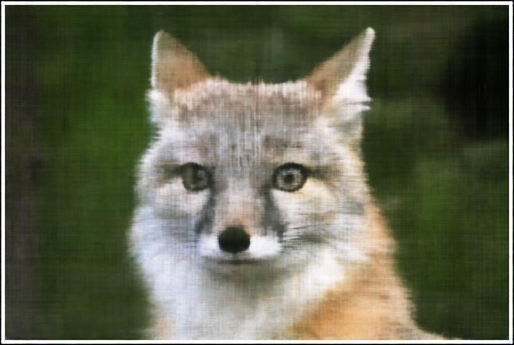
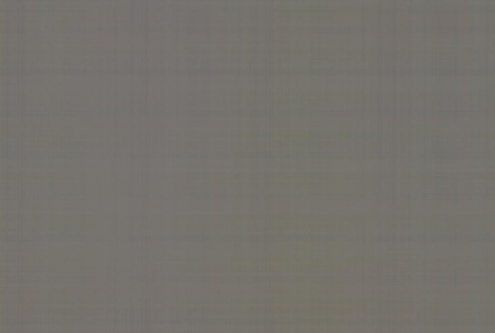
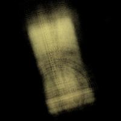

<!-- Support for MatJax -->

# Proj6: NeRF

Exploring stereo correspondence by recreating [NeRF](https://arxiv.org/pdf/2003.08934).

## Part 1: 2D MLP
Basically, for this model, it converts a `B x 2` batch of 2D coordinates and then converts it in to a `B x 3` batch of rgb values corresponding to those 2D coordinates. That way, I can generate a specifc image from a coordinate system of pixels (important for later). It first takes in the vector $X$. Then, pass it through a Sinusoidal Positional Encoding (SPE) to convert 2D coordinates into 3D coordinates. Then pass the 3D coordinates through a bunch of `256` sized Linear -> ReLU layers. Finally, at the end `3` sized Linear layer, pass the 3d coordinates through a Sigmoid Layer to predict a specific pixel coordinate's RGB value.

Here's the architecture for the MLP.

### fox.jpg

I initially trained the `fox.jpg` model with the following parameters: `lr=1e-2`, `num_layers=3`, `batch_size=10_000`, `L=10` and `iterations=3000`. (where lr is learning rate, num_layers is the number of linear/ReLU layers there are, and L being the max frequency for the SPE) I used Mean Squared Error Loss and the ADAM optimizer for training. Furthermore, I also used the Peak Signal-to-Noise  Ratio (PSNR) as a measure to determine how "good" an image was.

$$
PSNR = 10 \cdot log_{10}\left(\frac{1}{MSE}\right)
$$

Here are some images of the the reconstructed image during some of the iterations of the training process with the default hyperparameters:

<table>
    <tr>
        <td align="center">
            
            
Iteration 0

        </td>
        <td align="center">
            
            
Iteration 100

        </td>
        <td align="center">
            
            
Iteration 200

        </td>
    </tr>
    <tr>
        <td align="center">
            
            
Iteration 500

        </td>
        <td align="center">
            
            
Iteration 700

        </td>
        <td align="center">
            
            
Final

        </td>
    </tr>
</table>

Here are some of the model's performance after training on varying `learning rates` and the other hyperparameters remain the same.

Here are some images of the the reconstructed image during some of the iterations of the training process with the default hyperparameters `lr=1e-5`:

<table>
    <tr>
        <td align="center">
            
            
Iteration 0

        </td>
        <td align="center">
            
            
Iteration 200

        </td>
        <td align="center">
            
            
Iteration 500

        </td>
        <td align="center">
            
            
Iteration 700

        </td>
        <td align="center">
            
            
Final

        </td>
    </tr>
</table>

Here are some of the model's performance after training on varying `number of layers` in the model and the other hyperparameters remain the same.

Here are some images of the the reconstructed image during some of the iterations of the training process with the default hyperparameters `num_layers=7`:

<table>
    <tr>
        <td align="center">
            
            
Iteration 0

        </td>
        <td align="center">
            
            
Iteration 100

        </td>
        <td align="center">
            
            
Iteration 200

        </td>
    </tr>
    <tr>
        <td align="center">
            
            
Iteration 500

        </td>
        <td align="center">
            
            
Iteration 700

        </td>
        <td align="center">
            
            
Final

        </td>
    </tr>
</table>

### cat.jpg
Here's the MLP network ran with all default parameters and also varying learning rates.

Here's some iterations of `cat.jpg` with `lr=0.001` (max frequency) and other default hyperparamaters.

<table>
    <tr>
        <td align="center">
            
            
Iteration 0

        </td>
        <td align="center">
            
            
Iteration 100

        </td>
        <td align="center">
            
            
Iteration 200

        </td>
    </tr>
    <tr>
        <td align="center">
            
            
Iteration 500

        </td>
        <td align="center">
            
            
Iteration 700

        </td>
        <td align="center">
            
            
Final

        </td>
    </tr>
</table>

## Part 2: NeRF

### transform(c2w, x_c)
I batched transformed 3D camera coordinates `x_c` into world coordinates using the camera to world `c2w` transformation matrix. I matrix multiplied by batch using `torch.bmm()`. This formula is the conversion from world coordinates to image coordinates using the world to camera coordinate transformation matrix `w2c`. Keep in mind that that coordinates are stored `(B, 3)` tensors, while the formula is in `3 x 1` vectors for coordinates, so overall,I implemented the transpose of the formula after moving everything to one side by inversing the `w2c` matrix to get the `c2w` matrix.

### pixel_to_camera(K, uv, s)
Given the focal depth of the camera and the image dimensions, one can create the intrinsic matrix $K$.

$K$ is then used to project a 3D point into the camera coordinate `x_c` system using 2D pixel coordinates `uv` of an image. `s` here is used to provide to the depth to the 2D pixel coordinate so that it can be translated into 3D camera coordinates. Once again, I implemented the transpose of the formula for batched operations so it will be faster.

### pixel_to_ray(K, c2w, uv)
Given pixel coordinates, intrinsic matrix $K$, and `c2w` transformation matrix, we can find the origin of the camera and produce rays that will represent the camera's line of sight and how a 3D world coordinate is projected onto the image as a pixel from the camera's point of view.

The origin ray is calculated via this formula, where $R_{3x3}$ and $t$ is from the `w2c` matrix mentioned above.

$$
\begin{align} \mathbf{r}_o =
      -\mathbf{R}_{3\times3}^{-1}\mathbf{t} \end{align}
$$

The distance ray is calculated by this formula, where $X_w$ are world coordinates. The direction array is then noramlized into a unit vector norm using the l2 (or euclidan) norm.

$$
\begin{align} \mathbf{r}_d = \frac{\mathbf{X_w} - \mathbf{r}_o}{||\mathbf{X_w} -
      \mathbf{r}_o||_2} \end{align}
$$

Once again, I used `torch.bnn()` for batched matrix multiplications for faster operations.

### Sampling Rays
I created a `RaysDataset` class that contains all the pixel values and calculate ray values based off of pixel coordinates when sampled. Therfore, the sampling function was also built into this data set with a parameter `batch` for batch size.

When sampling, I flattened all coordinates of images in the image dataset into a 2D tensor and then used `torch.randint` to generate a list of random pixels to sample and rays to generate. I then returned a tuple containing `(batch, ...)` sized tensors of the origin rays `ray_o`, the direction rays `ray_d` and the pixel values of said coordinate `pixels`.

> Also all data was normalized for easier computation. i.e. RGB / 255.0, $X / ||X||_2$

### Sampling Plenoptic Points
Now that we have sampled random camera origins and camera directions (corresponding to image pixels), we can now sample points along this ray to get points that are represented by the Plenoptic function. This function is crucial to implement and I had several bugs where the `(u, v)` coordinates didn't correspond with the rays, or where `(u, v)` was flipped to `(v, u)`.

These points along with their direction ray correspondence then can be used to train a MLP deep neural network to output color and density values.

Here are the sampled rays from all cameras.

Here are the sampled rays from one camera

Here are the sampled rays from one camera on the top right from camera pov.

### 3D MLP Neural Network
I had the model forward function take in `(N, n_samples, 3)` tensors for both points and direction ray and then flattened the tensors within the forward function such that the Linear Layer can take it as an input. I would then unflatten the tensors after forwarding the inputs through the layers. Lastly, I would unflatten the tensors back into `(N, n_samples, _)` tesnors and return it. This simplified some processes and made the code looke cleaner

Here's the structure of the MLP for NeRF.

### Volumic Rendering
Using the batched densities and color values predicted by the model, as well as the `dt` between the `n_samples` samples along the ray, we can use volumetric rendering to predict a image coordinate pixel's color values.

We can do so using this discrete approximation of the formula.

$$
\begin{align}
      \hat{C}(\mathbf{r})=\sum_{i=1}^N T_i\left(1-\exp \left(-\sigma_i \delta_i\right)\right) \mathbf{c}_i, \text { where } T_i=\exp
      \left(-\sum_{j=1}^{i-1} \sigma_j \delta_j\right) \end{align}
$$

To implement this in code, I used `torch.cumsum` to calculated $T_i$ by running getting the cumulative sum of `dt * densities` and then subtracting `densities` from that cumsum such that we only get the sum up to `i-1`. Afterwards, I calculated the main function by multiplying $T_i$ with `1 - torch.exp(-densities * dt)` and the `colors` passed in. Lastly, I summed up the result using `torch.sum` along the `dim=1`, to get the sum for each batched image.

## Training The Model

The training loop goes as follows:
1. Sample `rays_o`, `rays_d`, `pixels`
2. Get the sampled `points` along `rays_d`
3. Pass in `points` and `rays_d` through the model's forward function
4. Pass in `pred_densities` and `pred_rgb` from the model's output into the `volumetric_rendering` function
5. Compare the `rgb` predicted by `volumetric_rendering` with the sampled pixels using a loss function
    - I used `nn.MSELoss`
6. Backpropogate and optimizer takes gradient step

### Train Loss and PSNR

> I ran 3000 iterations with `batch_size=30_000` to achieve `0.004` training loss and `23.435` training PSNR.

### Validation Loss and PSNR

> I ran 3000 iterations with `batch_size=30_000` to achieve `0.003` validation loss and `25.161` validation PSNR.

> There is probably something still wrong with my training loop, seeing that validation loss is lower than training loss.

### Rendering the Image
Reshape the `volumetric_rendering(pred_densities, pred_colors, dt)` output into the original images' dimension to the right corresponding coordinate system.

GPU may run out of memory, so "batch" the rendering process by calculating the predicted rgb values for sections of the image and then concatenating the results afterwards. Be careful to only transpose the image after concatenating everything. I personally did the reconstruction in `200x20` batches.

### Validation Image Reconstruction
These are reconstructions of the 0th image of the validation set during different iterations of the training process.

<table>
    <tr>
        <td align="center">
            
            
Iteration 0

        </td>
        <td align="center">
            
            
Iteration 100

        </td>
        <td align="center">
            
            
Iteration 200

        </td>
    </tr>
    <tr>
        <td align="center">
            
            
Iteration 500

        </td>
        <td align="center">
            
            
Iteration 700

        </td>
        <td align="center">
            
            
Iteration 900

        </td>
    </tr>
    <tr>
        <td align="center">
            
            
Iteration 3000

        </td>
        <td align="center">
            
            
Iteration 3500

        </td>
        <td align="center">
            
            
Iteration 3900

        </td>
    </tr>
</table>

### Running NeRF on `c2w` Test Set
Given a bunch of camera to world coordinate transformation matrices, the model generates the lego CAT.

## Bells and Whistles

### Depth Perception
This was done by modifying the volumetric perceptron function a bit. Instead of multiplying the equation with predicted rgbs, multiply the equation with `torch.linspace(1, 0, n_samples)` to put a near to far weight on the densities on a particular ray direction. Lighter is closer, darker is further.

 

### proj6: reflection

I learned a lot on how NeRF works through this project. It was fun yet tough to implement, but I did learn more about stereo correspondence and plenoptic functions.

[back to project list](../index.md)
